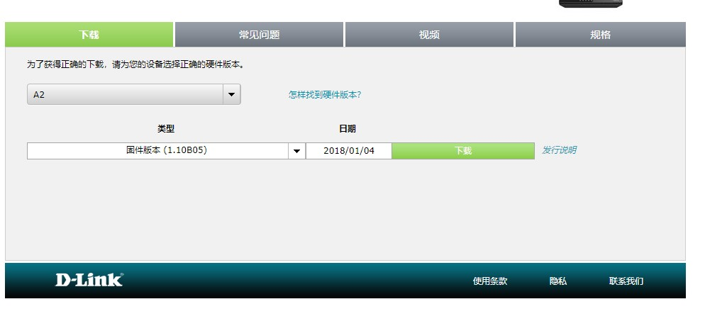
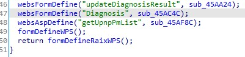

# D-Link DIR-816 A2 1.10 B05 command injection

## Firmware address
http://www.dlink.com.cn/techsupport/ProductInfo.aspx?m=DIR-816

## Vulnerability
Vulnerability is in ./bin/goahead. The function corresponding to Diagnosis can be found in the formDefineManagement function: 

In the sub_45AC4C function  

## Verify
